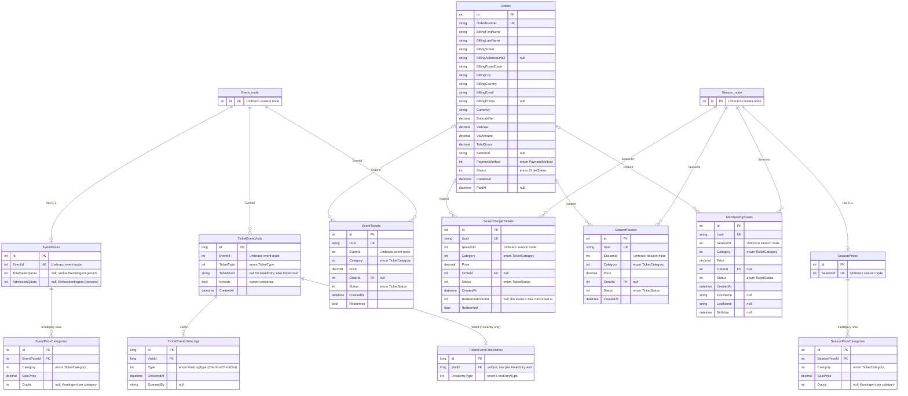

# RedAnts

Public website and self-service ticketing application for Red Ants Winterthur, built on **Umbraco CMS 17 / .NET 10**.

## Requirements

- .NET 10 SDK
- No external database needed: the app uses SQLite, created on first run.

## Run locally

```bash
dotnet run
```

The dev profile serves on:

- `https://localhost:44370` (and `http://localhost:54363`)
- Backoffice: `/umbraco`

On first start the app installs unattended (see `appsettings.Development.json`) with:

- User: `admin@localhost.dev`
- Password: `Admin1234!`

The SQLite database is created at `umbraco/Data/Umbraco.sqlite.db` (WAL mode is enabled before boot). Content types and sample content are seeded in code on startup, so no manual backoffice setup is required.

Local development runs with test Turnstile keys and empty Payrexx credentials; payment and captcha are effectively stubbed until real secrets are supplied via user secrets or configuration.

## Project layout

| Path | Purpose |
|------|---------|
| `Domain/` | Pure domain models, enums, value objects (no framework deps). |
| `Features/` | Application layer by use case, with `Ports/` interfaces. |
| `Infrastructure/` | Adapters: Umbraco integration, repositories, payment, email. Split into `Shared`, `Ticketing`, `Website`. |
| `Views/` | Razor views for the public website and ticketing pages. |
| `wwwroot/` | Static assets (`css/site.css` etc.). |
| `uSync/` | uSync content-type / configuration snapshots. |

## Data model (ticketing)

Catalog entities (Season, Venue, Event) are **Umbraco Document Types**, not database tables. Sales, admissions, and pricing live in NPoco tables created in one step by `CreateTicketingSchema` (`Infrastructure/Ticketing/TicketingMigration.cs`). The schema is a fresh install: to recreate it, delete the dev SQLite file (`umbraco/Data/Umbraco.sqlite.db`) and restart.

Conventions:

- **Enums are stored as their integer value** (not `nvarchar`): `Category`, `Status`, `PaymentMethod`, `TicketType`, `FreeEntryType`, and the visit-log `Type` columns are `int`.
- **No enforced foreign-key constraints** (loose coupling; relationships below are logical). `EventId` / `SeasonId` hold the **Umbraco content node id** of the event/season.
- A ticket's admission is one `TicketEventVisits` row per `(event, ticket)`; the individual in/out scans are appended to `TicketEventVisitsLogs`. `TicketEventVisits.TicketUuid` is a polymorphic link to the `Uuid` of the ticket named by `TicketType` (null for a `FreeEntry` visit, whose kind is in `TicketEventFreeEntries`).



Enum integer values (order defines the stored number):

| Enum | Values |
|------|--------|
| `TicketCategory` | 0 Adult, 1 AdultReduced, 2 Youth, 3 YouthReduced, 4 Child |
| `TicketType` | 0 EventTicket, 1 SeasonSingle, 2 SeasonPass, 3 MemberCard, 4 FreeEntry |
| `FreeEntryType` | 0 Player, 1 Staff, 2 Official, 3 SwissUnihockeyFreeCard |
| `OrderStatus` | 0 Draft, 1 Paid, 2 Cancelled, 3 Refunded |
| `TicketStatus` | 0 Valid, 1 Cancelled |
| `PaymentMethod` | 0 Payrexx, 1 Cash, 2 Twint, 3 Invoice |
| `VisitLogType` | 0 CheckIn, 1 CheckOut |

Availability for sale is resolved by `EventPricingReader`: a category is sold out once its own `Quota`, or the event's `TotalSalesQuota`, is reached by the valid `EventTickets` already issued. `AdmissionQuota` caps the number of admitted persons (tickets plus free entries).

## Documentation

- `ARCHITECTURE.md`: design, layering, content-slice model, the ticketing data model, code-first seeding, and the runtime-compiled Razor caveats.
- `CLAUDE.md` / `AGENTS.md`: working conventions for AI coding agents.

## Tech stack

Umbraco 17, .NET 10, SQLite, uSync, Sqids (opaque URL ids), Payrexx (payment), Brevo (email), Cloudflare Turnstile (captcha). Default culture is Swiss German (`de-CH`).
