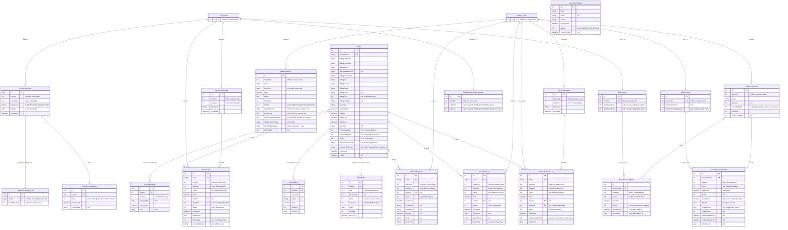

# RedAnts

Public website and self-service ticketing application for Red Ants Winterthur, built on **Umbraco CMS 17 / .NET 10**.

## Environments

Each surface has its own custom domain, routed by host in `Program.cs`:

| Surface | Production | Dev |
|---|---|---|
| Public / tickets | `tickets.redants.ch` | `tickets-dev.redants.ch` |
| Scanning | `scan.redants.ch` | `scan-dev.redants.ch` |
| Admin / backoffice | `admin.redants.ch` | `admin-dev.redants.ch` |

App Services `app-redants-prod` / `app-redants-dev` (Switzerland North). Only `tickets.redants.ch` is search-indexed; all other hosts (every `*-dev`, the scan/admin subdomains, `*.azurewebsites.net`) send `noindex`. Payrexx: prod uses the live `redants` instance, dev the `redants-test` instance.

## Requirements

- .NET 10 SDK
- Access to the shared **Azure SQL dev database**. There is no local database file: a local run connects to the same Azure SQL dev database as the DEV app, through a user-secrets connection string. SQLite has been removed entirely.

Set the dev connection string once as a user secret:

```bash
dotnet user-secrets set "ConnectionStrings:umbracoDbDSN" "<dev Azure SQL DSN>"
dotnet user-secrets set "ConnectionStrings:umbracoDbDSN_ProviderName" "Microsoft.Data.SqlClient"
```

## Run locally

```bash
dotnet run
```

- Serves on the ports in `Properties/launchSettings.json`; backoffice at `/umbraco`.
- The Umbraco schema and an admin account already live in the shared dev database, so there is no installer step. Content types and sample content are (re)seeded in code on every boot, idempotently.
- Local development runs with test Turnstile keys and empty Payrexx credentials, so captcha and payment are effectively stubbed until real secrets are supplied via user secrets.
- A soft **site access gate** (HTTP Basic, `BasicAuth:Password`) fronts the public site in every environment. To browse locally without it, start with an empty password (`BasicAuth__Password=`) or unlock via `/__gate` (or append `?key=<password>` to any URL).

## Project layout

| Path | Purpose |
|------|---------|
| `Domain/` | Pure domain models, enums, value objects (no framework deps). |
| `Features/` | Application layer by use case, with `Ports/` interfaces. |
| `Infrastructure/` | Adapters: Umbraco integration, repositories, payment, email. Split into `Shared`, `Ticketing`, `Website`. |
| `Views/` | Razor views for the public website and ticketing pages. |
| `wwwroot/` | Static assets (`css/site.css` etc.). |
| `uSync/` | uSync content-type / configuration snapshots. |

## Data model (ticketing)

Catalog entities (Season, Venue, Event) are **Umbraco Document Types**, not database tables. Sales, admissions, pricing, add-ons, the email outbox and the session cache live in NPoco tables, created by `CreateTicketingSchema` plus a chain of additive migrations in `Infrastructure/Ticketing/TicketingMigration.cs`. The build is **fully idempotent and re-runs on every boot**: `TicketingMigrationComponent` resets the recorded migration state to empty first, then each table is created only when missing (`EnsureTable`/`TableExists`) and each new column is gated by `ColumnExists`. A new table or column therefore appears on the next start with no database drop, and parallel branches sharing the dev database never desync.

Conventions:

- **Enums are stored as their integer value** (not `nvarchar`): `Category` (`TicketCategory`, or `MemberCategory` on `MembershipCards`), `Status`, `PaymentMethod`, the order's `PaymentSource` and `BillingType` (`BuyerType`), `TicketType`, `FreeEntryType`, the visit-log `Type`, `OrderItemKind`, `AddOnScope` and the outbox `Status` (`EmailStatus`) are all `int` columns.
- **No enforced foreign-key constraints** (loose coupling; relationships below are logical). `EventId` / `SeasonId` hold the **Umbraco content node id** of the event/season.
- A ticket's admission is one `TicketEventVisits` row per `(event, ticket)`; the individual in/out scans are appended to `TicketEventVisitsLogs`. `TicketEventVisits.TicketUuid` is a polymorphic link to the `Uuid` of the ticket named by `TicketType` (null for a `FreeEntry` visit, whose kind is in `TicketEventFreeEntries`).


```mermaid
erDiagram
    Event_node  ||--o| EventPrices : "has 0..1"
    Season_node ||--o| SeasonPrices : "has 0..1"
    Season_node ||--o{ SeasonPriceTiers : "SeasonId"
    Season_node ||--o{ SeasonAddOns : "SeasonId"
    EventPrices  ||--o{ EventPriceCategories : "n category rows"
    SeasonPrices ||--o{ SeasonPriceCategories : "n category rows"
    SeasonPriceTiers |o--o{ EventPriceCategories : "TierId"
    SeasonPriceTiers |o--o{ SeasonPriceCategories : "TierId"

    Orders |o--o{ EventTickets : "OrderId"
    Orders |o--o{ SeasonSingleTickets : "OrderId"
    Orders |o--o{ SeasonPasses : "OrderId"
    Orders |o--o{ MembershipCards : "OrderId"
    Orders ||--o{ OrderItems : "OrderId (financial line items)"
    Orders ||--o{ OrderAddOns : "OrderId (add-on lines)"
    Orders ||--o{ OrderStatusLogs : "OrderId (status history)"

    Event_node  ||--o{ EventTickets : "EventId"
    Season_node ||--o{ SeasonSingleTickets : "SeasonId"
    Season_node ||--o{ SeasonPasses : "SeasonId"
    Season_node ||--o{ MembershipCards : "SeasonId"
    Event_node  ||--o{ TicketEventVisits : "EventId"
    Event_node  ||--o| TicketEventFreeEntryQuotas : "EventId (0..1)"

    Event_node  ||--o{ EventTicketBundles : "EventId"
    Season_node ||--o{ FlexTicketBundles : "SeasonId"
    EventTicketBundles |o--o{ EventTickets : "BundleId"
    FlexTicketBundles  |o--o{ SeasonSingleTickets : "BundleId"

    TicketEventVisits ||--o{ TicketEventVisitsLogs : "VisitId"
    TicketEventVisits ||--o| TicketEventFreeEntries : "VisitId (FreeEntry only)"

    Event_node {
        int Id PK "Umbraco content node"
    }
    Season_node {
        int Id PK "Umbraco content node"
    }

    Orders {
        int Id PK
        string OrderNumber UK
        string BillingFirstName
        string BillingLastName
        string BillingStreet
        string BillingAddressLine2 "null"
        string BillingPostalCode
        string BillingCity
        string BillingCountry
        string BillingEmail
        string BillingPhone "null"
        int BillingType "null; enum BuyerType"
        string BillingCompany "null"
        string Currency
        decimal SubtotalNet
        decimal VatRate
        decimal VatAmount
        decimal TotalGross
        string SellerUid "null"
        int PaymentMethod "enum PaymentMethod"
        int PaymentSource "null; enum PaymentSource"
        int Status "enum OrderStatus"
        string PayrexxGatewayId "null; Payrexx gateway id"
        string FulfillmentPayload "null; JSON snapshot for the webhook"
        datetime CreatedAt
        datetime PaidAt "null"
    }

    EventTickets {
        int Id PK
        string Uuid UK
        int EventId "Umbraco event node"
        int Category "enum TicketCategory"
        int TierId "null; SeasonPriceTiers"
        decimal Price
        int OrderId FK "null"
        int BundleId FK "null; EventTicketBundles"
        int Status "enum TicketStatus"
        datetime CreatedAt
        bool Redeemed
        int BuyerType "null; enum BuyerType"
        string CreatedByName "null; admin creator"
    }

    SeasonSingleTickets {
        int Id PK
        string Uuid UK
        int SeasonId "Umbraco season node"
        int Category "enum TicketCategory"
        int TierId "null; SeasonPriceTiers"
        decimal Price
        int OrderId FK "null"
        int BundleId FK "null; FlexTicketBundles"
        int Status "enum TicketStatus"
        datetime CreatedAt
        int RedeemedEventId "null; the event it was consumed at"
        bool Redeemed
    }

    SeasonPasses {
        int Id PK
        string Uuid UK
        int SeasonId "Umbraco season node"
        int Category "enum TicketCategory"
        int TierId "null; SeasonPriceTiers"
        decimal Price
        int OrderId FK "null"
        int Status "enum TicketStatus"
        datetime CreatedAt
        string Reference "null"
        string BuyerEmail "null"
        int BuyerType "null; enum BuyerType"
    }

    MembershipCards {
        int Id PK
        string Uuid UK
        int SeasonId "Umbraco season node"
        int Category "enum MemberCategory"
        int OrderId FK "null"
        int Status "enum TicketStatus"
        datetime CreatedAt
        string FirstName "null"
        string LastName "null"
        datetime Birthday "null"
        string Email "null"
        string Reference "null"
    }

    TicketEventVisits {
        long Id PK
        int EventId "Umbraco event node"
        int TicketType "enum TicketType"
        string TicketUuid "null for FreeEntry; else ticket Uuid"
        bool IsInside "current presence"
        datetime CreatedAt
    }

    TicketEventVisitsLogs {
        long Id PK
        long VisitId FK
        int Type "enum VisitLogType (CheckIn/CheckOut)"
        datetime OccurredAt
        string ScannedBy "null"
    }

    TicketEventFreeEntries {
        long Id PK
        long VisitId FK "unique; one per FreeEntry visit"
        int FreeEntryType "enum FreeEntryType"
    }

    EventPrices {
        int Id PK
        int EventId UK "Umbraco event node"
        int TotalSalesQuota "null; Verkaufskontingent gesamt"
        int AdmissionQuota "null; Einlasskontingent (persons)"
    }

    EventPriceCategories {
        int Id PK
        int EventPriceId FK
        int Category "enum TicketCategory"
        int TierId "null; SeasonPriceTiers"
        decimal SalePrice
        int Quota "null; Kontingent per category"
        datetime AvailableUntil "null; sale deadline"
        guid ArticleGuid "null; stable article id"
    }

    SeasonPrices {
        int Id PK
        int SeasonId UK "Umbraco season node"
        int TotalSalesQuota "null"
        int DefaultTicketSalesQuota "null; default for new events"
    }

    SeasonPriceTiers {
        int Id PK
        int SeasonId "Umbraco season node"
        string Name
        int MaxAge "null"
        int PromoOfTierId "null; makes this the promo of a base tier"
        int SortOrder
        int LegacyCategory "null"
    }

    SeasonPriceCategories {
        int Id PK
        int SeasonPriceId FK
        int Category "enum TicketCategory"
        int TierId "null; SeasonPriceTiers"
        decimal SalePrice "pass price"
        int Quota "null"
        decimal TicketPrice "null; season single-ticket price"
        bool Offered "null; pass offered"
        bool TicketOffered "null; single ticket offered"
        int TicketQuota "null"
        datetime PassAvailableUntil "null"
        datetime TicketAvailableUntil "null"
        guid ArticleGuid "null"
    }

    SeasonAddOns {
        int Id PK
        int SeasonId "Umbraco season node"
        string Label
        string LongTitle "null; public promo title"
        decimal Price
        bool Active
        int SortOrder
        int Scope "enum AddOnScope (PerPass/PerOrder)"
        string AllowedTierIds "null; CSV of tier ids, empty = all"
        bool PromoOnly "only offered on a promo tier"
        bool RequireMobileNumber "forces mobile number at checkout"
        string InfoBeforePurchase "null; tooltip"
        string InfoAfterPurchase "null; confirmation + mail"
        guid ArticleGuid "null"
    }

    OrderItems {
        int Id PK
        int OrderId FK
        int Kind "enum OrderItemKind"
        guid ArticleGuid "null"
        int RefId "event or season node id"
        int Category "enum TicketCategory"
        string Label
        int Quantity
        decimal UnitPrice
    }

    OrderAddOns {
        int Id PK
        int OrderId FK
        int SeasonId
        string Label
        decimal Price
        int Quantity
        bool Delivered
    }

    OrderStatusLogs {
        long Id PK
        int OrderId FK
        int ToStatus "enum OrderStatus"
        string ChangedBy "null"
        datetime OccurredAt
        string Note "null"
    }

    EventTicketBundles {
        int Id PK
        int EventId "Umbraco event node"
        int Category "enum TicketCategory"
        string Reference
        datetime CreatedAt
    }

    FlexTicketBundles {
        int Id PK
        int SeasonId "Umbraco season node"
        int Category "enum TicketCategory"
        string Reference
        datetime CreatedAt
    }

    TicketEventFreeEntryQuotas {
        int Id PK
        int EventId "Umbraco event node"
        int SuQuota "null; +Player/Staff/Official/Child/Helper quotas"
        int SuFixed "null; +Player/Staff/Official/Child/Helper fixed pre-counts"
    }

    NewsletterSignups {
        int Id PK
        string Email
        string Name "null"
        string Source
        datetime SignedUpAt
        int Status "enum NewsletterTransferStatus"
        datetime TransferredAt "null"
    }
```

Enum integer values (order defines the stored number):

| Enum | Values |
|------|--------|
| `TicketCategory` | 0 Adult, 1 AdultPromo, 2 Youth, 3 YouthPromo, 4 Child |
| `MemberCategory` (on `MembershipCards`) | 0 RedAnts, 1 Block4 |
| `TicketType` | 0 EventTicket, 1 SeasonSingle, 2 SeasonPass, 3 MemberCard, 4 FreeEntry |
| `FreeEntryType` | 0 Player, 1 Staff, 2 Official, 3 SwissUnihockeyFreeCard, 4 Child, 5 Helper |
| `OrderStatus` | 0 Draft, 1 Paid, 2 Cancelled, 3 Refunded |
| `TicketStatus` | 0 Valid, 1 Cancelled, 2 Blocked |
| `PaymentMethod` | 0 Payrexx, 1 Cash, 2 Twint, 3 Invoice, 4 Manual |
| `PaymentSource` | 0 Sponsoring, 1 Marketing, 2 Goodwill, 3 Online, 4 Cash, 5 TwintCode, 6 Terminal, 7 Invoice |
| `BuyerType` (order `BillingType`, ticket `BuyerType`) | 0 Private, 1 Company |
| `OrderItemKind` | 0 EventTicket, 1 SeasonSingle, 2 SeasonPass, 3 MemberCard, 4 AddOn |
| `AddOnScope` | 0 PerPass, 1 PerOrder |
| `VisitLogType` | 0 CheckIn, 1 CheckOut |
| `NewsletterTransferStatus` | 0 Pending, 1 Transferred |

`TicketCategory` is retained on issued rows for labelling, but **live pricing is keyed by per-season price tiers** (`SeasonPriceTiers`), not the fixed category: a tier carries a `Name`, optional `MaxAge`, and an optional `PromoOfTierId` that makes it the Sonderaktion variant of a base tier. `EventPriceCategories`/`SeasonPriceCategories` and the issued tickets/passes therefore carry a nullable `TierId`.

Availability for sale is resolved by `EventPricingReader`: a category is sold out once its own `Quota`, or the event's `TotalSalesQuota`, is reached by the valid `EventTickets` already issued. `AdmissionQuota` caps the number of admitted persons (tickets plus free entries).

## Documentation

- `ARCHITECTURE.md`: design, layering, content-slice model, the ticketing data model, code-first seeding, and the runtime-compiled Razor caveats.
- `CLAUDE.md` / `AGENTS.md`: working conventions for AI coding agents.

## Tech stack

Umbraco 17, .NET 10, **Azure SQL** (`Microsoft.Data.SqlClient`), uSync, Sqids (opaque URL ids), Payrexx (payment), Microsoft Graph (transactional email, drained from a SQL outbox), QuestPDF (PDF tickets), Cloudflare Turnstile (captcha), Azure Blob Storage (media in prod). Default culture is Swiss German (`de-CH`).
